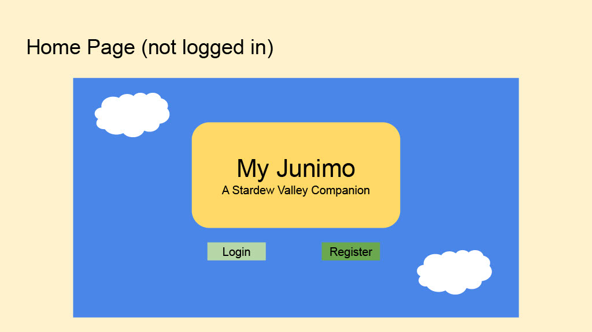
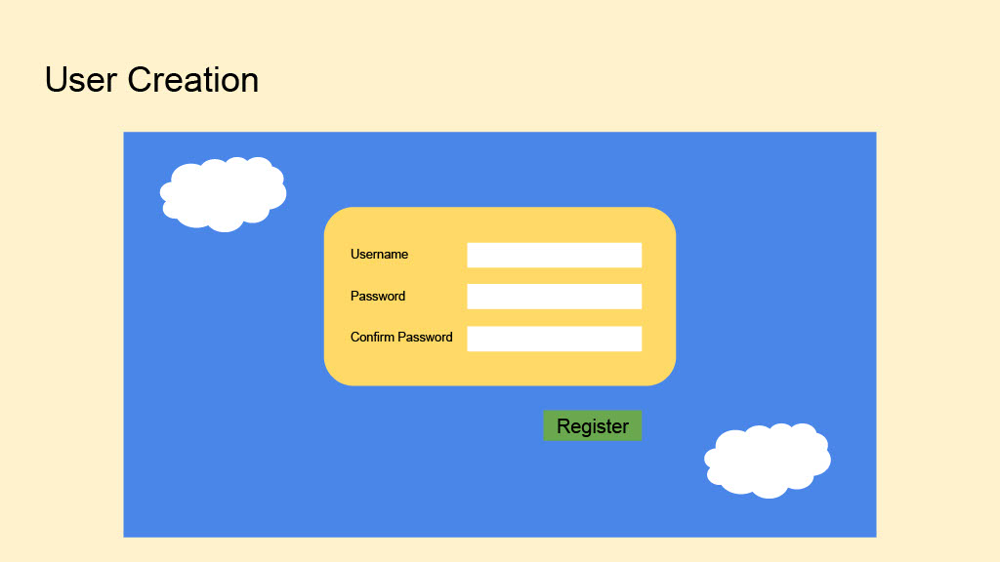
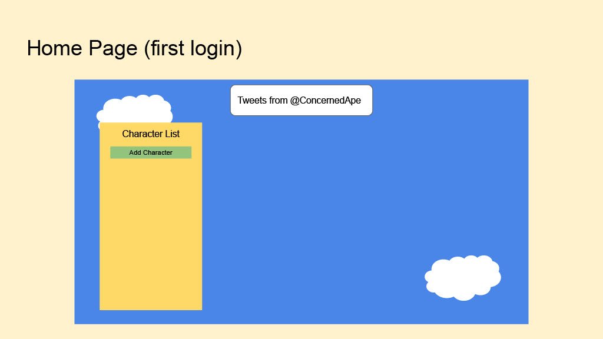
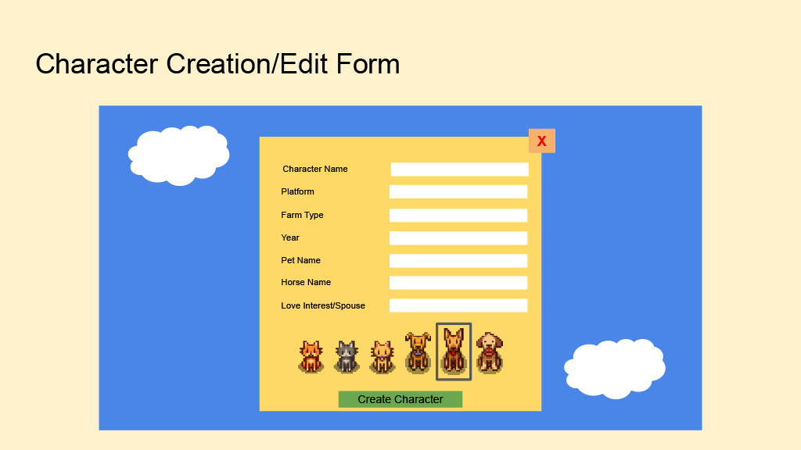
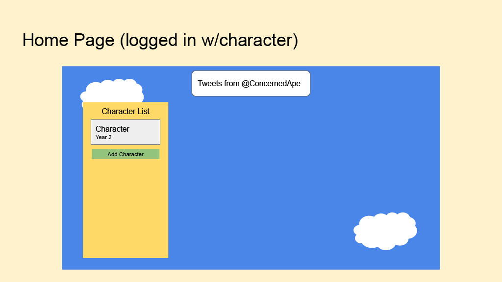
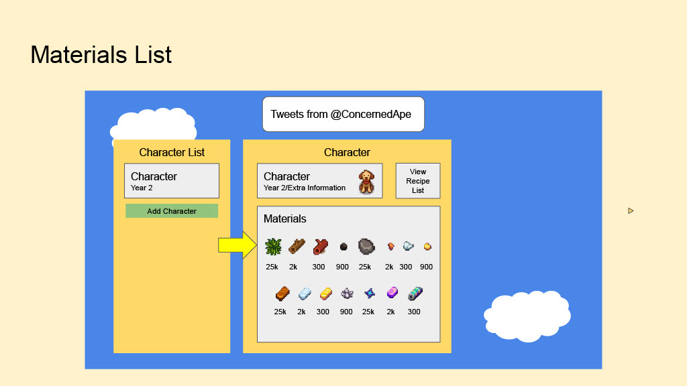
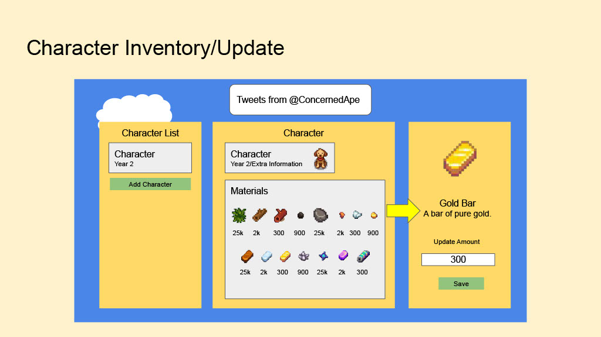
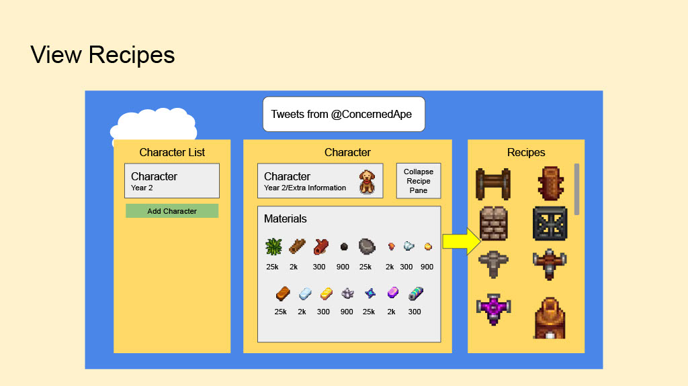
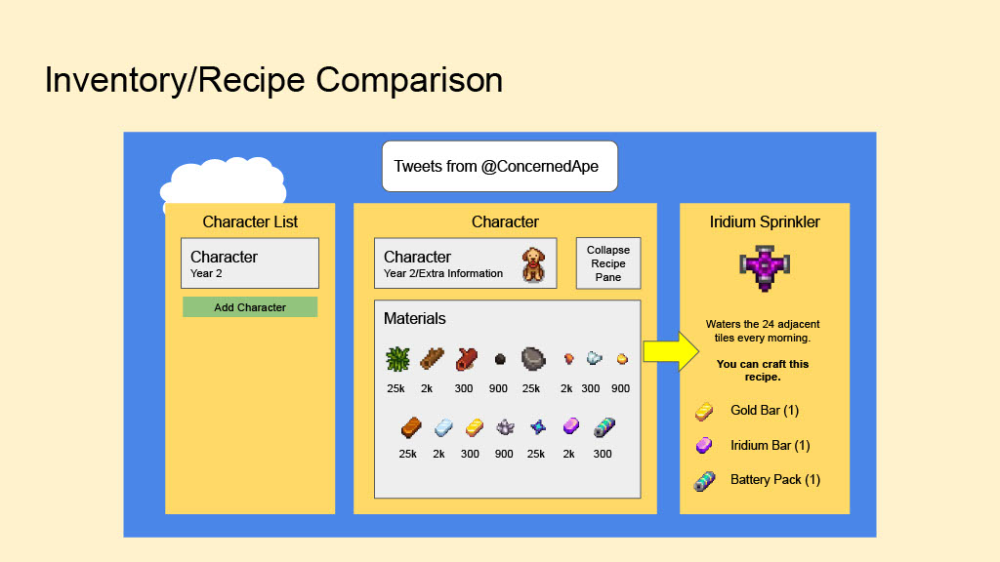

# my-Junimo-Client

# Summary: 
Finally, an app that makes resource and crafting management easy in Stardew Valley! This app allows you to manage the inventory of your character(s) and easily see if your inventory meets the requirements for crafting items (and larger projects!) inside Stardew Valley.

# Link to API Repo
https://github.com/alysvolatile/my-junimo-api

# Links to Deployed
Deployed Client: https://my-junimo-helper.herokuapp.com/
Deployed API: https://my-junimo-api.herokuapp.com/

# Technologies Used
Django/SQL Backend (Python)
React Frontend

# Requirements
You will need to run `npm install` to acquire the necessary dependencies for this project. Data is stored and seeded via scripts found in the backend repo above.

# Approach
The app is structured as a three branches underneath one main UserHome component. CharacterContainer, ProfileContainer, and InfoContainer are all children of this primary component, and each one renders conditionally based on the status of multiple state hooks in UserHome. These state hooks trigger various data retrieval actions on the backend, allowing the same components to render different character details, as well as requiring only one component hierarchy for displaying all blueprints, one blueprint, or one character inventory resource.

When an action occurs on one "branch" of the UI (say, updating the quantity of a material in the character's inventory), the HTTP request also sets a new state in the UserHome Component. That state variable is loaded into the dependency array of all relevant components, prompting a useEffect trigger that updates the information across the application. It is designed as a truly one-screen application experience.

# Team:
Nick Esparza, Alys Cooper

# User Stories

## User Model 
* As a user, I want to be able to sign up for an account (and specify which platform I am playing SV on).
* As a user, I want to be able to sign into my account.
* As a user, I want to be able to change my password.
* As a user, I want to be able to sign out of my account.
## Character Model 
* As a user, I want to be able to create a character (save file) and save them to my account, with the option to have multiple characters per user.
* As a user, I want to be able to edit a character.
* As a user, I want to view all of my characters in an index.
* As a user, I want to view one of my characters.
## Resources 
* As a user, I want to view all resources.
* As a user, I want to view one resource.
* As a user, I want to be able to add specific numbers of resources into my character's inventory.
## Crafting Recipes 
* As a user, I want to view all crafting recipes.
* As a user, I want to view one crafting recipe.
* As a user, I want to be able to compare the required materials for a crafting recipe and see if I have enough resources in my inventory to craft that item.

### STRETCH GOALS:
* As a user, I want to be able to click a button ('Item Crafted') that automatically removes the required type and amount of materials from my character's inventory.
## Construction Project Blueprints
* As a user, I want to view all construction project blueprints.
* As a user, I want to view one construction project blueprint.

# Wireframes

